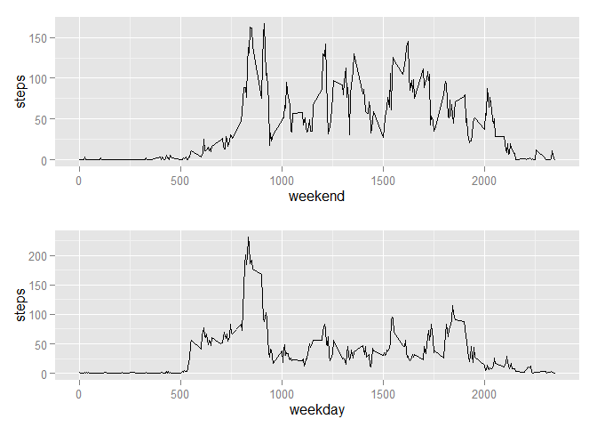

# PA1_template
This is a markdown for Peer Assessement 1 in Reproducible Research Course in Data Science Specialization

## Loading and preprocessing the data


```r
activity <- read.csv("C:\\Data\\R\\activity.csv")

a1 <- na.omit(activity)

library(ggplot2)
```

## Task 1: What is mean total number of steps taken per day?


```r
total<- aggregate(steps ~ date, data=a1, sum)
a1$date <- as.Date(a1$date) 

ggplot(a1, aes(date, steps)) + geom_bar(stat="identity") + labs(x = "Days in 2012")
```

 

The mean and the median:

```r
total<- aggregate(steps ~ date, data=a1, sum)
mean(total$steps)
```

```
## [1] 10766.19
```

```r
median(total$steps)
```

```
## [1] 10765
```

## Task 2: What is the average daily activity pattern?

A time series plot of the 5-minute interval (x-axis) and the average number of steps taken, averaged across all days (y-axis).  


```r
ag <- aggregate(steps ~ interval, data = activity, mean)
ggplot(ag, aes(interval, steps)) + geom_line(stat="identity") + labs(x = "Time of day")
```

 

5-minute interval, on average across all the days in the dataset, containing the maximum number of steps. At 8:35, apparently people going to work!  


```r
maximal <- ag$steps>=round(max(ag$steps))
ag[maximal,]
```

```
##     interval    steps
## 104      835 206.1698
```
## Task 3: Imputing missing values
  
Total number of NAs

```r
sum(is.na(activity))
```

```
## [1] 2304
```
Creating a new dataset. 

```r
x <- 1
activity1 <- activity
while(x<nrow(activity1))
{
  if(is.na(activity1[x,1]==T))
    {
    activity1[x,1] <- ag[ag$interval == activity1[x,3],2]
  }
  x <- x+ 1
}
```
Creating a new histogram.

```r
activity1$date <- as.Date(activity1$date)
ggplot(activity1, aes(date, steps)) + geom_bar(stat="identity") + labs(x = "Days in 2012")
```

```
## Warning: Removed 1 rows containing missing values (position_stack).
```

 

Mean and median of nez dataset with no NAs. Comparing with the dataset with NAs, obviously there are changes in median, not in mean.


```r
total<- aggregate(steps ~ date, data=activity1, sum)
mean(total$steps)
```

```
## [1] 10766.17
```

```r
median(total$steps)
```

```
## [1] 10766.19
```
## Task 4: Are there differences in activity patterns between weekdays and weekends?

Yes, differences are quite visible. On average people walk more on weekends. 
I am using the multiplot function to visualize. The website reference is in the code. 


```r
weekattribute <- function(x) {
  if(weekdays(x) == 'dimanche' | weekdays(x) == 'samedi')
  {return('weekend')}
  else 
  {return('weekday')}}
activity1$weekday <- sapply(activity1$date, weekattribute)

endactivity <- activity1[activity1$weekday=='weekend',]
weekactivity <- activity1[activity1$weekday=='weekday',]

endag <- aggregate(steps ~ interval, data = endactivity, mean)
weekag <- aggregate(steps ~ interval, data = weekactivity, mean)

g1 <- ggplot(endag, aes(interval, steps)) + geom_line(stat="identity") + labs(x = "weekend")
g2 <- ggplot(weekag, aes(interval, steps)) + geom_line(stat="identity") + labs(x = "weekday")

## a nice multiplot function, found here http://www.cookbook-r.com/Graphs/Multiple_graphs_on_one_page_%28ggplot2%29/
multiplot <- function(..., plotlist=NULL, file, cols=1, layout=NULL) {
  require(grid)
  
  # Make a list from the ... arguments and plotlist
  plots <- c(list(...), plotlist)
  
  numPlots = length(plots)
  
  # If layout is NULL, then use 'cols' to determine layout
  if (is.null(layout)) {
    # Make the panel
    # ncol: Number of columns of plots
    # nrow: Number of rows needed, calculated from # of cols
    layout <- matrix(seq(1, cols * ceiling(numPlots/cols)),
                     ncol = cols, nrow = ceiling(numPlots/cols))
  }
  
  if (numPlots==1) {
    print(plots[[1]])
    
  } else {
    # Set up the page
    grid.newpage()
    pushViewport(viewport(layout = grid.layout(nrow(layout), ncol(layout))))
    
    # Make each plot, in the correct location
    for (i in 1:numPlots) {
      # Get the i,j matrix positions of the regions that contain this subplot
      matchidx <- as.data.frame(which(layout == i, arr.ind = TRUE))
      
      print(plots[[i]], vp = viewport(layout.pos.row = matchidx$row,
                                      layout.pos.col = matchidx$col))
    }
  }

}
multiplot(g1, g2)
```

```
## Loading required package: grid
```

 
